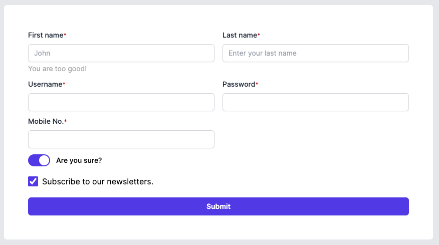

# @ascendtis/react-a-form

Ascendtis own's Instant validation AForm component.

  

## Mandatory Steps
- Add './node_modules/@ascendtis/react-a-form/dist/esm/**/*.{js,ts}' to your `tailwind.config.js` file in `content` section

  

## Example

   

    <AForm
	    onSubmit={(values) => console.log("Form Values:", values)}
	    values={{
		    first_name: 'John',
		    last_name: 'Doe'
		}}
    >
	    

			<AFormInput  name={'first_name'} label={'First name'} type='text' placeholder='John' hint='You are too good!' validation={{required: true}} />
			<AFormInput  name={'last_name'} label={'Last name'} type='text' placeholder='Enter your last name' validation={{required:  true}} />
		

		

			<AFormInput  name={'email'} label={'Email'} type='email' placeholder='Email address'  validation={{required: true, email: true}} />
			<AFormInput  name={'password'} label={'Password'} type='password' placeholder='Password'  validation={{required: true}} />
		

		

			<AFormInput  name={'newsletters'} label='Subscribe to our newsletters.'  type='checkbox'  />
		

		

			<AButton  type='submit' style={{ width: '100%'}}>Submit</AButton>
		

    </AForm>

  
  

## Available FormInputs
- TextInput
- Checkbox
- Toggle Switch
- Action Button

  

## Validations
- Required
- Email